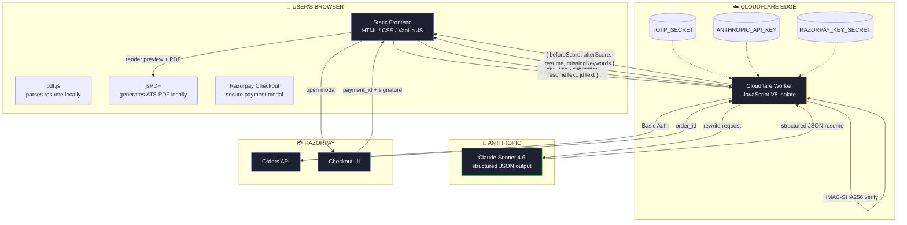
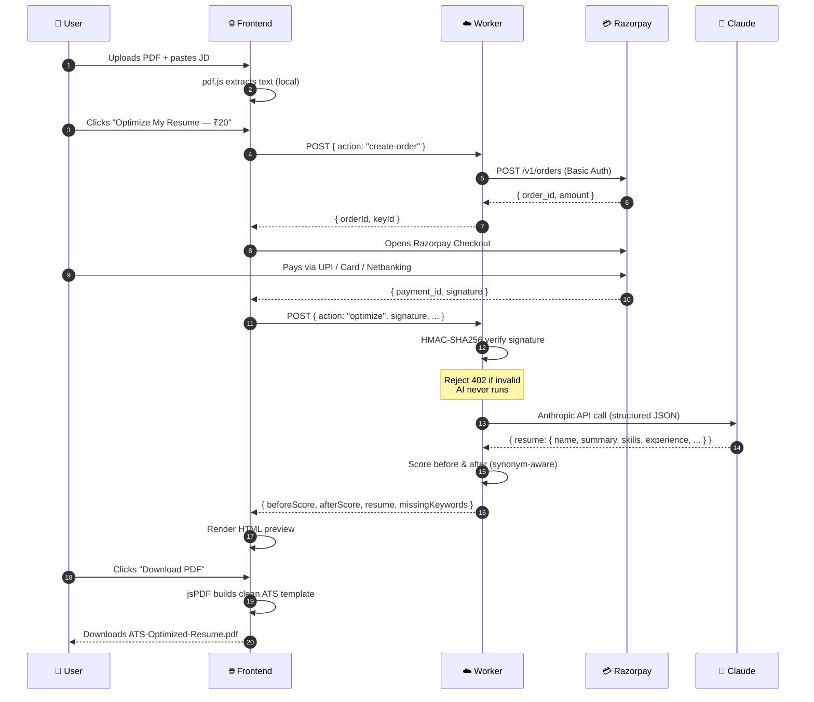
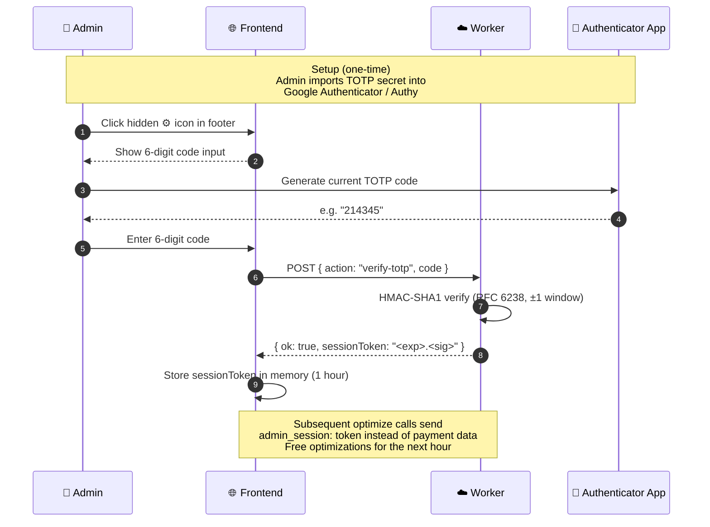
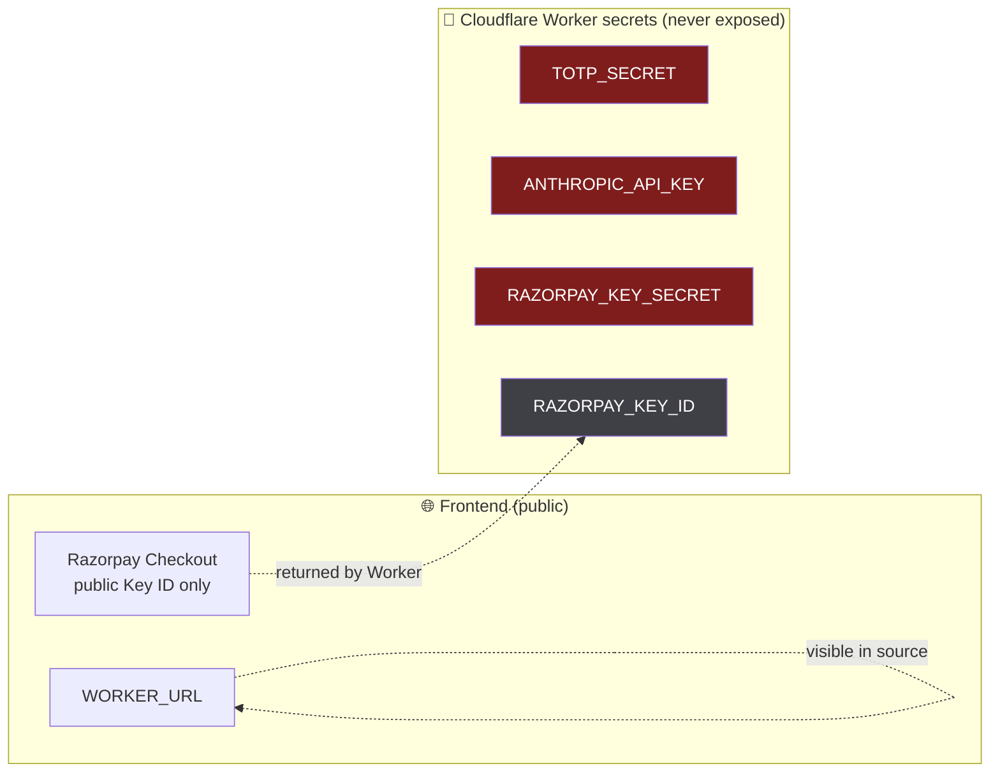

<div align="center">

# 🎯 ATS Resume Optimizer

### *Beat the bots. Land the interview.*

Upload your resume. Paste a job description. Get back a **rewritten, ATS-optimized resume** scored against the exact job — with the keywords recruiters' tracking systems are searching for, surfaced honestly from your real experience.

[](https://nayakdarshan.github.io/ats-resume-optimizer/)
[](https://www.linkedin.com/in/darshan-nayak-4a9a27143/)
[](https://www.linkedin.com/in/darshan-nayak-4a9a27143/)

</div>

---

## ✨ Why does this exist?

> Over **75% of resumes** are filtered out by Applicant Tracking Systems (ATS) **before a human ever sees them**.

The bots scan for exact keywords from the job description — and if your resume doesn't have them in the right places, you're rejected automatically, no matter how qualified you are.

This tool fixes that. It reads your resume + the job description, rewrites your resume to honestly mirror the job's language, and gives you a clean PDF that sails through the bots.

<div align="center">

### 🟢 [**Try it live →**](https://nayakdarshan.github.io/ats-resume-optimizer/)

</div>

---

## 🎬 How it works — in 60 seconds

<div align="center">

| 1️⃣ | 2️⃣ | 3️⃣ | 4️⃣ |
|:-:|:-:|:-:|:-:|
| **Upload your resume** | **Paste the job description** | **Pay ₹20 (UPI / cards)** | **Download your optimized PDF** |
| 📄 PDF parsed in your browser | 📝 Any role, any company | 🔒 Secure via Razorpay | ⬇️ Real selectable text, ATS-ready |

</div>

That's it. ~30 seconds end-to-end.

---

## 🎁 What you get back

<table>
<tr>
<td width="50%" valign="top">

### 📊 Before & After Score

A 0–100 ATS match score on your **original** resume *and* the **optimized** version. Watch the number jump.

### 🔑 Keyword Gap Table

Every important keyword from the job description, with a clear ✓ / ✗ — so you can see exactly what was missing and what's been added.

</td>
<td width="50%" valign="top">

### ✍️ AI-Rewritten Resume

Bullets rewritten with strong action verbs, your real metrics, and the job's exact terminology. **Your company names, dates, and titles stay 100% untouched.**

### 📄 Clean ATS-Parseable PDF

Single-column, professional layout, real selectable text (not a screenshot of text). The format every ATS can read perfectly.

</td>
</tr>
</table>

---

## 💎 Built on a foundation of honesty

This tool **never invents experience you don't have**. It only takes the skills you already have and renames them to match the job description's vocabulary, where that renaming is truthful.

**Examples of honest surfacing:**
- *"Built reusable UI components"* + job wants *"component-driven architecture"* → renames to **"component-driven architecture"** ✅ (true — just elevated wording)
- *"Wrote Jest tests"* + job wants *"unit testing"* → adds **"unit testing"** ✅ (same thing, JD's language)
- *"Used Docker"* + job wants *"containerization"* → adds **"containerization"** ✅
- *"Used Angular"* + job wants *"SPA"* → adds **"single-page applications (SPA)"** ✅

**What it will never do:**
- ❌ Invent skills you don't have
- ❌ Fake employers, titles, or dates
- ❌ Add metrics that weren't in your original resume

If a critical skill is genuinely missing, the tool tells you in the gap table — so you can be honest in your application and focus on roles you'll actually succeed in.

---

## 💰 Pricing

<div align="center">

### **₹20 per optimization** &nbsp;·&nbsp; pay-as-you-go

| Payment method | Status |
|---|:-:|
| 🟣 UPI | ✅ |
| 💳 Cards (Visa / Mastercard / RuPay) | ✅ |
| 🏦 Net Banking | ✅ |
| 📱 Wallets | ✅ |

No subscription. No account needed. Pay only for what you use, securely via Razorpay.

</div>

---

## 👤 About the Creator

<div align="center">

### **Darshan Nayak**
*Software Engineer · Builder · Problem-Solver*

I built this tool because too many talented people get rejected by **algorithms** before a human ever reads their resume. That's not fair — and it's fixable. I designed the entire system: the keyword scoring engine, the AI prompt strategy, the security & payment architecture, and the user experience.

The implementation was done in close collaboration with **[Claude Code](https://claude.com/claude-code)** — Anthropic's coding assistant — which sped up the build dramatically while I focused on architecture, product decisions, and making sure every piece worked the way I'd designed it.

<br>

[](https://www.linkedin.com/in/darshan-nayak-4a9a27143/)
[](https://github.com/nayakdarshan)

</div>

---

<br>
<br>

# ⚙️ Technical Documentation

> *The section above is for everyone. Everything below is for engineers, recruiters who want to understand the stack, and contributors.*

---

## 🏛️ Architecture Overview

The system is split into **three independent layers**, each chosen for a specific reason: a static frontend for zero hosting cost, a serverless edge worker for low-latency global execution + secret isolation, and Anthropic's Claude as the AI engine.



### The user's payment journey, in detail



### Admin bypass flow (TOTP)



---

## 🧠 The Smart Scoring Engine

The biggest technical challenge wasn't calling an AI — it was **measuring honestly** how well a resume matches a job description, while crediting *renamed* matches (like Jest → unit testing) without rewarding fabrication.

The scorer uses three layers:

### 1. Curated Vocabulary (~190 phrases)
Hand-picked terms across frontend, backend, cloud, testing, data, ML, and methodology. Generic English words like "team", "build", or "design" are excluded — they're noise, not signal.

### 2. Synonym Groups
Every variant of a term maps to **one canonical token**, so the scorer credits the candidate when any honest variant appears:

| Canonical | Variants treated as equal |
|---|---|
| `ci/cd` | CI/CD, Continuous Integration, Continuous Deployment, Continuous Delivery |
| `spa` | SPA, single-page application, single-page applications |
| `unit testing` | Unit tests, Jest, Vitest, Mocha, Jasmine, Karma |
| `e2e testing` | End-to-end testing, Cypress, Playwright, Selenium |
| `containerization` | Docker, container |
| `state library` | Redux, MobX, Zustand, NgRx, RxJS, Context API, … |
| `relational database` | PostgreSQL, MySQL, SQL Server, Oracle, SQLite |

### 3. Weighted Phrase-Boundary Matching
- Multi-word phrases match before single tokens (so "React Native" doesn't wrongly count as "React")
- Alphanumeric-only word boundaries — so trailing punctuation doesn't break the match
- JD term weight = `min(frequency, 4)` — caps a single noisy repeat from dominating
- A term is a HIT if **any** canonical variant appears in the resume

**Result:** a candidate with real React/TS/Redux/Jest/Cypress/CI experience scores **97/100** against a matching frontend SDE-2 JD. A backend-only candidate against the same JD scores **3/100** — honest gap shown, never inflated.

---

## 🔒 Security Model



| Threat | Mitigation |
|---|---|
| **Resume data leaked** | Resume text never leaves the user's browser until they pay & submit. No database, no logs, no analytics. |
| **API key exposed** | All sensitive keys are Cloudflare Worker secrets — never in the frontend, never in the repo. |
| **Forged payment** | Server verifies Razorpay's `HMAC-SHA256(order_id\|payment_id, KEY_SECRET)` before calling Anthropic. Invalid signature → `402`, AI never runs. |
| **Admin bypass abuse** | TOTP (RFC 6238) replaces shareable static password. Codes rotate every 30s. Session tokens are HMAC-signed and expire in 1 hour. |
| **Replay attacks** | Razorpay signatures are tied to a unique order ID; one payment = one optimization. |
| **Stolen TOTP secret** | Constant-time signature comparison; secret stored as Worker secret and visible only in the user's authenticator app. |

---

## 🛠️ Tech Stack

<table>
<tr>
<td valign="top" width="33%">

### **Frontend**
- Vanilla HTML / CSS / JavaScript
- No framework, no build step
- [pdf.js](https://mozilla.github.io/pdf.js/) — PDF text extraction
- [jsPDF](https://github.com/parallax/jsPDF) — PDF generation
- [Razorpay Checkout](https://razorpay.com/docs/payments/payment-gateway/web-integration/standard/) — payment modal
- Hosted on **GitHub Pages**

</td>
<td valign="top" width="33%">

### **Edge Compute**
- [Cloudflare Workers](https://workers.cloudflare.com/)
- JavaScript V8 Isolate runtime
- Web Crypto API (HMAC-SHA1, HMAC-SHA256)
- Wrangler for deployment
- Global edge — sub-50ms latency worldwide
- Zero cold-start

</td>
<td valign="top" width="33%">

### **AI & Payments**
- [Anthropic Claude Sonnet 4.6](https://www.anthropic.com/) — resume rewriting
- Structured JSON output (no parsing fragility)
- [Razorpay](https://razorpay.com/) — Indian payment gateway
- UPI / Cards / Netbanking / Wallets
- HMAC-SHA256 server-side verification

</td>
</tr>
</table>

---

## 📁 Repository Structure

```
ats-resume-optimizer/
├── index.html              # Single-page UI
├── app.js                  # Frontend logic, scorer, PDF generation
├── styles.css              # Dark theme, responsive
├── README.md               # You are here
└── worker/
    ├── worker.js           # Cloudflare Worker — Razorpay, TOTP, Claude proxy
    └── wrangler.toml       # Worker config
```

**No `package.json`, no `node_modules`, no build step.** Everything runs as either:
- Static files (frontend) → served by GitHub Pages
- One ES module file (worker) → deployed by `wrangler deploy`

---

## 🚀 Self-Hosting

### Prerequisites
- Node.js 22+ (for Wrangler)
- A Cloudflare account (free tier works)
- An Anthropic API key
- A Razorpay account (test mode keys work without KYC)

### 1. Clone & deploy frontend
```bash
git clone https://github.com/nayakdarshan/ats-resume-optimizer.git
cd ats-resume-optimizer
# Enable GitHub Pages in repo settings → Pages → Source: main branch
```

### 2. Deploy the Worker
```bash
npm install -g wrangler
wrangler login
cd worker
wrangler deploy
# Note the URL printed: https://ats-optimizer.<your-subdomain>.workers.dev
```

### 3. Set the four secrets
```bash
wrangler secret put ANTHROPIC_API_KEY   # sk-ant-...
wrangler secret put RAZORPAY_KEY_ID     # rzp_test_... or rzp_live_...
wrangler secret put RAZORPAY_KEY_SECRET # from Razorpay dashboard
wrangler secret put TOTP_SECRET         # base32 string (generate one — see below)
```

### 4. Generate a TOTP secret (for admin mode)
```bash
node -e "
const c = require('crypto');
const a = 'ABCDEFGHIJKLMNOPQRSTUVWXYZ234567';
let bits = 0, value = 0, out = '';
for (const b of c.randomBytes(20)) {
  value = (value << 8) | b; bits += 8;
  while (bits >= 5) { out += a[(value >>> (bits - 5)) & 31]; bits -= 5; }
}
console.log(out);
"
```
Then import into Google Authenticator / Authy: **"Enter a setup key"** → paste the base32.

### 5. Wire the Worker URL into the frontend
Open `app.js`, line 2:
```js
const WORKER_URL = 'https://ats-optimizer.<your-subdomain>.workers.dev';
```
Commit and push — GitHub Pages auto-redeploys.

---

## 📡 Worker API Reference

All endpoints: `POST` with JSON body.

### `verify-totp`
```json
// Request
{ "action": "verify-totp", "code": "123456" }

// Response (200)
{ "ok": true, "sessionToken": "<exp>.<hex_sig>", "expiresIn": 3600 }

// Response (401)
{ "error": "Invalid or expired code" }
```

### `create-order`
```json
// Request
{ "action": "create-order" }

// Response (200)
{ "orderId": "order_xxx", "amount": 2000, "currency": "INR", "keyId": "rzp_test_xxx" }
```

### `optimize` (paid path)
```json
// Request
{
  "action": "optimize",
  "razorpay_order_id": "order_xxx",
  "razorpay_payment_id": "pay_xxx",
  "razorpay_signature": "<hex>",
  "resumeText": "...",
  "jobDescription": "..."
}

// Response (200)
{
  "beforeScore": 42,
  "afterScore": 89,
  "missingKeywords": ["graphql", "kubernetes"],
  "resume": {
    "name": "...",
    "title": "...",
    "contact": { "email": "...", "phone": "...", "location": "...", "links": [] },
    "summary": "...",
    "skills": [ { "category": "Frontend", "items": ["..."] } ],
    "experience": [ { "company": "...", "title": "...", "dates": "...", "bullets": ["..."] } ],
    "projects": [],
    "education": [ { "degree": "...", "institution": "...", "dates": "..." } ]
  }
}

// Response (402) — bad signature → AI is never called
{ "error": "Payment signature verification failed." }
```

### `optimize` (admin path)
```json
{ "action": "optimize", "admin_session": "<exp>.<sig>", "resumeText": "...", "jobDescription": "..." }
```

---

## 🤝 Credits

- **Architecture, product design, security model, scoring engine design:** [Darshan Nayak](https://www.linkedin.com/in/darshan-nayak-4a9a27143/)
- **Implementation assisted by:** [Claude Code](https://claude.com/claude-code) (Anthropic's coding assistant)
- **AI rewrite engine:** Claude Sonnet 4.6
- **Hosting:** GitHub Pages (frontend) + Cloudflare Workers (edge)
- **Payments:** Razorpay

---

<div align="center">

### Built with ❤️ in India by [**Darshan Nayak**](https://www.linkedin.com/in/darshan-nayak-4a9a27143/)

*If this tool helped you land an interview, drop me a message on LinkedIn — I'd love to hear about it.*

[](https://www.linkedin.com/in/darshan-nayak-4a9a27143/)

</div>
